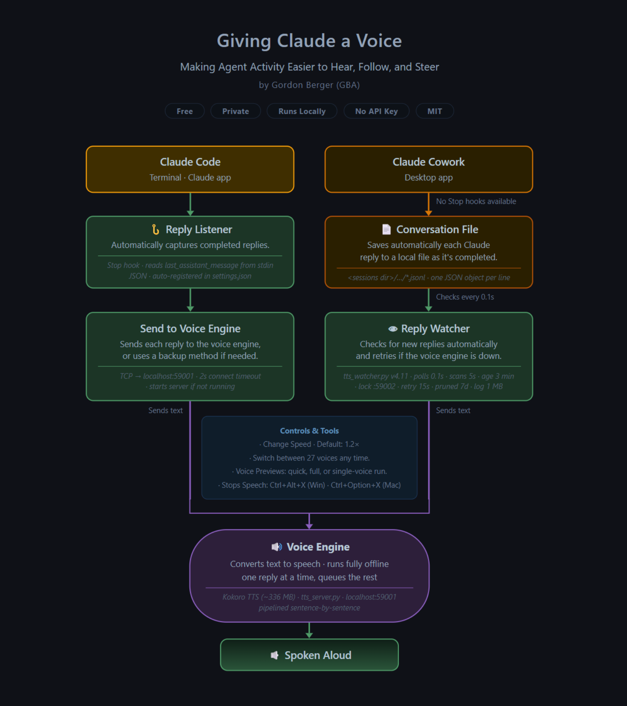
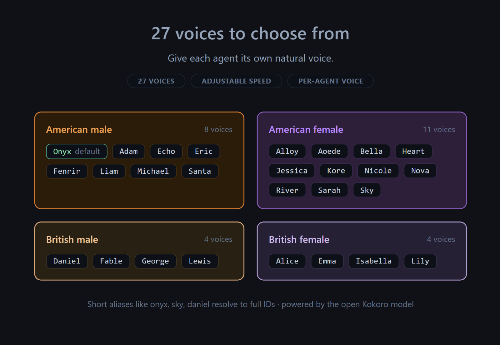

<p align="center">
  <br>
  
</p>

<div align="center">

# Omnicapable Voice for Claude Cowork

   

[Install](#install) · [How it works](#how-it-works) · [Controls](#controls) · [Troubleshooting](#troubleshooting)

</div>

Every completed message in a Claude Cowork session is spoken aloud automatically. A background watcher reads the transcript on disk, so nothing is copied or pasted and nothing leaves your machine. (Regular Claude Code CLI sessions are handled by a separate Stop hook, see [Claude Code](https://github.com/Omnicapable/claude-code-tts).)

> **Part of Omnicapable:** Omnicapable bridges AI activity and human agency, making machine behavior easier to see, hear, follow, and steer. See also: [Claude Code](https://github.com/Omnicapable/claude-code-tts) · [Codex](https://github.com/Omnicapable/codex-tts).
>
> **Not affiliated.** An independent, open-source Omnicapable project, not affiliated with or endorsed by Anthropic. The Claude and Cowork names are used only to indicate compatibility.

---

## What makes this different

This is not a generic text-to-speech add-on. It is built for coding agents:

- **Built for agents, not bolted on.** A background watcher reads each finished reply straight from the Cowork transcript, so every message is spoken automatically. No copy-paste, no reading your screen.

- **Tuned for agent output.** It reads the explanation unchanged and skips what doesn't belong in speech, like code blocks, tables, URLs, and emoji. You hear the point, not the syntax.

- **Local, private, and free.** Everything runs offline with the open Kokoro model. No API keys, no accounts, no cloud, no cost.

- **Shared engine across your agents.** Claude Code, Claude Cowork, and Codex install separately but share one local voice engine and controls, so each new one reuses what's already there and behaves the same.

- **Keeps you in the loop.** Hear what your agent is doing and guide it while your eyes are elsewhere. It runs in the background, so it never slows your agent down.

- **Yours to tune.** 27 voices and adjustable speed, with a per-tool voice so parallel agents sound distinct.

- **More accessible.** A comfortable way to work with AI for people with dyslexia, low vision, or screen fatigue.

---

## Install

Setup takes just a few clicks and configures everything for you automatically.

**➡️ Let your AI do it.**

Just paste this into Claude:

```
Clone https://github.com/Omnicapable/claude-cowork-tts and run the installer for my OS.
Run it to completion and show me the final summary. Tell me first if git or Python 3.9+ is missing.
```

It clones and installs everything for you.

---

**Prefer to do it yourself?**

**1. Get the files.** Open **Terminal** (macOS) or **PowerShell** (Windows) and run:
```
git clone https://github.com/Omnicapable/claude-cowork-tts
cd claude-cowork-tts
```
No `git`? On macOS, the first `git` command offers to install Apple's Command Line Tools; accept it. On Windows, install [Git for Windows](https://git-scm.com/download/win), or download the ZIP (green **Code** button → **Download ZIP**), unzip, and `cd` in.

**2. Run the installer for your OS** (from inside that folder):

**macOS:** in Terminal:
```
chmod +x Mac/install_cowork_tts_Mac.sh && ./Mac/install_cowork_tts_Mac.sh
```

**Windows:** in the `Windows` folder, right-click `install_cowork_tts_Windows.ps1` and choose *Run with PowerShell*.

The installer sets up everything for you automatically (one time, downloads ~336 MB of model files):
1. Installs Python packages (`kokoro-onnx`, `sounddevice`, `numpy`)
2. Downloads the Kokoro ONNX model and voices
3. Writes the TTS server and watcher scripts
4. Adds both to auto-start at login
5. Launches everything immediately

After install, Claude's responses are spoken automatically, with no further setup.

<details>
<summary><b>Requirements</b></summary>

- Windows 10/11 or macOS 12+
- Python 3.9+
- Claude Desktop (Cowork mode) installed

</details>

---

## How it works

Both Claude setups feed the same local Voice Engine (Kokoro), differing only in how they capture a finished reply.

<p align="center">
  
</p>

### How they differ

| Feature | Claude Code | Claude Cowork |
| --- | --- | --- |
| How it detects a new reply | A listener fires the moment Claude finishes writing (Stop hook, every response). | A background watcher checks the transcript file every 0.1s (`tts_watcher.py`). |
| Where it reads the reply | Directly from Claude, passed in as the reply ends (`last_assistant_message` from hook stdin). | From the conversation file saved on disk (lines with `stop_reason=end_turn`). |
| If the Voice Engine is down | Retries with a 2s timeout, then skips that reply silently. Run `restart_tts.ps1` to recover. | Skips for 15s, then retries automatically (`KOKORO_RETRY_SECONDS = 15`). |
| Starts at login | Voice engine starts automatically. | Watcher and auto-restarter both start automatically. |
| Does Claude do anything | No, fully automatic. | No, fully automatic. |

<br>

Both share the same controls: 27 voices, adjustable speed (default 1.2x), voice previews, stop speech with Ctrl+Alt+X (Windows) / Ctrl+Option+X (macOS), and replay the last answer with Ctrl+Alt+R / Ctrl+Option+R.

---

## Source files (`src/`)

These are installed automatically by the installer. They are included here for reference, or if you want to update without reinstalling.

| File | Purpose |
| --- | --- |
| `tts_watcher.py` | Main watcher loop. Monitors the Cowork sessions directory, speaks each completed assistant message, and handles special queue commands. v4.9 |
| `watchdog.ps1` | Keeps `tts_watcher.py` and the Kokoro server alive, restarting whichever stops responding. Heartbeat to `%LOCALAPPDATA%\tts\watchdog.log` every 5 minutes. v3 |
| `preview_voices.py` | Source voice demo helper. The installed watcher routes queue previews through the installed `%USERPROFILE%\.claude\kokoro\tts_preview.py`; this source helper is only a fallback or demo script. |
| `seed_state.py` | One-off migration helper. Pre-populates `tts_watcher_state.json` with the current line counts of every existing transcript, so the first run does not replay old sessions. Safe to re-run. |

The installer also writes these runtime files to the install directory:
- `tts_watcher_state.json`, an auto-managed position tracker (never edit by hand); entries older than 7 days are pruned automatically.
- `tts_watcher_log.txt`, the watcher activity log; capped at 1 MB, rotating to `tts_watcher_log.txt.prev` when full.
- `tts_queue.txt`, watched for special commands only (see Controls below).

---

## Controls

Ask Claude directly (*"turn voice off"*, *"speak faster"*, *"switch to voice sky"*), or run the scripts yourself.

| Action | Command |
| --- | --- |
| Change voice | `set_voice.py <voice>` |
| Change speed (0.5 to 2.5) | `set_speed.py --up` / `--down` / `1.5` |
| Turn on or off | `toggle_tts.ps1` (`on` / `off`) |
| Stop, status, restart | `stop_tts.ps1` · `status_tts.ps1` · `restart_tts.ps1` |
| Stop current speech | `Ctrl+Alt+X` (Windows) / `Ctrl+Option+X` (macOS) |
| Replay last answer | `Ctrl+Alt+R` (Windows) / `Ctrl+Option+R` (macOS) |
| Preview voices | *"quick preview voices"* or *"preview all voices"* |

Voice and speed scripts live in `%USERPROFILE%\.claude\kokoro\`; the toggle, stop, status, and restart scripts live in `%USERPROFILE%\.claude\`.

<p align="center">
  
</p>

<details>
<summary><b>All 27 voices and previews</b></summary>

- American male: `am_onyx` (default), `am_adam`, `am_echo`, `am_eric`, `am_fenrir`, `am_liam`, `am_michael`, `am_santa`
- American female: `af_alloy`, `af_aoede`, `af_bella`, `af_heart`, `af_jessica`, `af_kore`, `af_nicole`, `af_nova`, `af_river`, `af_sarah`, `af_sky`
- British female: `bf_alice`, `bf_emma`, `bf_isabella`, `bf_lily`
- British male: `bm_daniel`, `bm_fable`, `bm_george`, `bm_lewis`

Preview voices by writing one command into `tts_queue.txt` in your install directory:

- `quick preview voices`, a quick representative preview
- `preview all voices`, all voices (about 3 minutes)
- `preview voice onyx`, a single voice using a friendly alias

Legacy tokens still work: `__PREVIEW_QUICK__`, `__PREVIEW_ALL__`, `__PREVIEW_VOICE__:am_onyx`. The queue is command-only; unknown or explanatory text is logged and ignored instead of spoken.

</details>

<details>
<summary><b>What gets spoken (text cleaning rules)</b></summary>

The server cleans the text before synthesising. These are silently skipped or replaced:

- **Code blocks** are removed entirely; only the surrounding explanation is read.
- **Markdown tables** are replaced with "attached table".
- **URLs** are replaced with "link".
- **Emoji** are stripped.
- **Abbreviations** are expanded - `e.g.` becomes "for example", `vs.` becomes "versus", and `$50` becomes "50 dollars".

</details>

---

## How replay is prevented

When the watcher sees a JSONL file it has not tracked before, it decides where to start reading:

1. **Known transcript:** if `tts_watcher_state.json` has a saved position for this path, resume there. No replay, ever.
2. **Fresh file** (modified within 60 seconds): treat as a new session and read from line 0 to catch the first reply.
3. **Stale file** (found on watcher startup): skip to the end and only speak future lines.

The position is saved after every speech, so a crash or restart cannot cause replay either.

---

## Troubleshooting

**It replayed a bunch of old messages.**
1. Check `tts_watcher_log.txt` for a `Tracking new session (fresh, reading from start)` line right before the replay.
2. Check whether `tts_watcher_state.json` exists and has an entry for the replayed transcript.
3. Run `py -3 seed_state.py` to repopulate the state from every transcript on disk, then restart the watcher.

**Nothing is being spoken.**
- Run `status_tts.ps1`. Is the Kokoro server up on port 59001?
- Check `%LOCALAPPDATA%\tts\watchdog.log`. Is the watchdog running?
- Check `tts_watcher_log.txt`. When was the last "Speaking:" line?
- Check `%USERPROFILE%\.claude\tts_enabled.txt`. Does it contain `on`?
- If Kokoro just crashed or restarted, the watcher has a 15-second cooldown after a failed send. Wait 15 seconds and it recovers automatically.

**Two voices are speaking the same reply.**
Make sure nothing writes normal speech to `tts_queue.txt`; that queue is for preview commands only (see Voice previews above), not for speech. If both Claude Cowork TTS and Claude Code TTS are installed, confirm they are not both watching the same transcript: Cowork TTS watches the Cowork sessions directory, while Claude Code TTS speaks only through its Stop hook.

---

## Uninstall
```
powershell -File %USERPROFILE%\.claude\uninstall_tts.ps1
```
Then remove the watcher's auto-start entry and delete the install directory. On macOS, remove the launchd agents for the watcher and watchdog.

---

## Credits

Built on the open [Kokoro ONNX](https://github.com/thewh1teagle/kokoro-onnx) text-to-speech model, which runs fully offline on CPU.

Created by [Gordon Berger](https://github.com/GordonBerger), part of [Omnicapable](https://github.com/Omnicapable).

---

## License

MIT License. See [LICENSE](LICENSE) for details.
